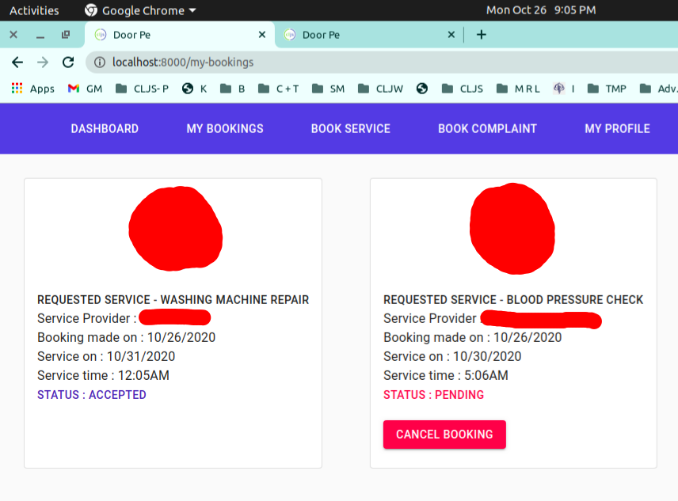
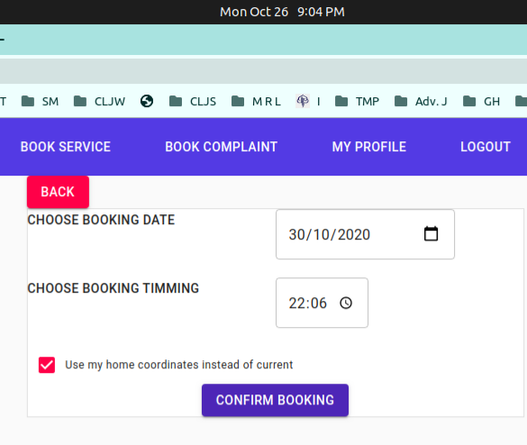

# DoorPe - A Smart Multiple Services Portal

DoorPe is a web portal that facilitates access to a variety of **on-demand home services at one place**. It helps customers to hire trusted professionals for their services at their convenience in an effective and cost-effective manner. These services include cleaning, plumbing, carpentry, interior design, wedding photography, yoga training, and many more related services.  

**Users can access and book a wide range of services through DoorPe**. They can book and subsequently track the status of their bookings, see the earlier work done by the service providers, and rate the provider accordingly.

This platform creates a bridge between professionals and customers. To access the application, all the stakeholders need to be registered with the application. There will be separate registration links for professionals and customers for obtaining the necessary registration.  After getting the necessary registration, the customers can avail a variety of services provided by professional service providers.  Accordingly, service providers can view, accept, and decline the service requests of the customers as per their availability and nature of service requests.

# Goals and Objectives

1. To provide a platform that will act as a bridge between customers and various service providers.
2. To Implement a secure Token(JWT tokens) based login system.
3. To use different methods to inform the users like direct inbox message (SMS Gateway), Voice call OTP, system-generated email (Email gateway).
4. Use of GPS to track the exact location of the client.
5. To design an interactive and user-friendly interface.

# Tech Stack

Backend programming language: **Clojure**

 
 
 

Frontend programming language: **Clojurescript**

 
 
 

Database: **MongoDB**

 
 
 

Code Editor: **Visual Studio Code**

 
 
 

Build automation tool: **leiningen**

 
 
 

Clojure + Clojurescript development environment tool: **Calva**

 
 
 

Version control: **Git & Github**

 
 
 

# Conclusion

* It has been such an exciting and challenging project for all of us ( `Basit Shafi(MCA-17-11)`, `Mahroosha Jalal(MCA-17-14)`, `Afshana Parveen(MCA-17-02)`, `Salfeyah Gull(MCA-17-15)`). **This project gave us a lot of practical knowledge about how to develop a web Application using a functional programming approach**. This project helped us to realize the potential which is present in developing web-based applications like this. It was really fun to work in a team-like environment.

* We developed a web-based application "DoorPe - A Smart Multiple Services Portal" which provides a platform for the customer and the service provider where they can book/provide services, check booking status, Accept/Reject/Cancel their bookings.

* A customer can provide his/her GPS coordinates to the service provider where the service provider has to deliver the service. Users of the system can provide access to his/her account to any third-party application. Notifications will be sent via emails to the users to keep them updated. Both customers and service provider can book their complaints to the admin, the admin's reply will be sent to them via email.

* Talking about the revenue model, a service provider has to pay a fixed amount to us for each accepted booking, which can be paid either online or offline. The service provider can check his pending dues and payments history. Besides this, here are a lot of features that facilitate the bookings. All our five main objectives have been completed. Overall the project can be considered a success.

## Future Scope / Recommendation

The future scope of this project is immense. The use of mobile phones in our daily life for minor things is increasing, This project can be a game-changer in the service booking sector. It is highly useful for all types of customers and service providers in many ways.
This project "DoorPe" opens many possibilities in the future for better enhancement, such as :

* Integration of Payment Gateway.
* Implement Cookies (Did not implemented, due to time constraints).
* Support for Android Environment.
* An allocation algorithm that will choose the most .appropriate service provider
* Chat-based communication system.
* Implement Ratings and reviews system.
* Support for a notification system.
* Use of some Google APIs  - Directions API, Geocoding API, Geolocation API, Distance Matrix API.
* Sorting, filtering the available service providers.
* Make the application more robust.
* Build a more user-friendly interface.

## BIBLIOGRAPHY
##### Books Reffered

[1. Clojure for the Brave and True: Learn the Ultimate Language and Become a Better Programmer - Daniel Higginbotham](https://www.braveclojure.com/)

[2. programming Clojure - Alex Miller, Stuart Halloway, Aaron Bedra](https://pragprog.com/titles/shcloj3/programming-clojure-third-edition/)

[3. The Clojure Workshop: A New, Interactive Approach to Learning Clojure - Joseph Fahey, Scott McCaughie, and Thomas Haratyk](https://www.packtpub.com/product/the-clojure-workshop/9781838825485)

[4. Living Clojure: An Introduction and Training Plan for Developers - Carin Meier](https://www.oreilly.com/library/view/living-clojure/9781491909270/)

[5. Clojure Cookbook: Recipes for Functional Programming - VanderHart and Ryan Neufeld](https://www.oreilly.com/library/view/clojure-cookbook/9781449366384/)
 
##### Sites Referred:
[1. http://clojuremongodb.info/](http://clojuremongodb.info/)

[2. https://docs.mongodb.com/manual/tutorial/](https://docs.mongodb.com/manual/tutorial/)

[3. https://funcool.github.io/ ](https://funcool.github.io/)

[4.1. http://kendru.github.io/restful-clojure/2014/02/16/writing-a-5.restful-web-service-in-clojure-part-1-setup/](http://kendru.github.io/restful-clojure/2014/02/16/writing-a-5.restful-web-service-in-clojure-part-1-setup/)

[4.2. http://kendru.github.io/restful-clojure/2014/02/19/getting-a-web-server-up-and-running-with-compojure-restful-clojure-part-2/](http://kendru.github.io/restful-clojure/2014/02/19/getting-a-web-server-up-and-running-with-compojure-restful-clojure-part-2/)

[4.3. http://kendru.github.io/restful-clojure/2014/03/01/building-out-the-web-service-restful-clojure-part-3/](http://kendru.github.io/restful-clojure/2014/03/01/building-out-the-web-service-restful-clojure-part-3/)

[4.4. http://kendru.github.io/restful-clojure/2015/03/13/securing-service-restful-clojure-part-4/](http://kendru.github.io/restful-clojure/2015/03/13/securing-service-restful-clojure-part-4/)

[5. http://rundis.github.io/blog/2015/buddy_auth_part1.html](http://rundis.github.io/blog/2015/buddy_auth_part1.html)

[6. http://rundis.github.io/blog/2015/buddy_auth_part2.html](http://rundis.github.io/blog/2015/buddy_auth_part2.html)

[7. http://rundis.github.io/blog/2015/buddy_auth_part3.html](http://rundis.github.io/blog/2015/buddy_auth_part3.html)

[8. http://rundis.github.io/blog/2015/buddy_auth_part4.html](http://rundis.github.io/blog/2015/buddy_auth_part4.html)

[9. https://www.bradcypert.com/using-json-web-tokens-with-clojure/](https://www.bradcypert.com/using-json-web-tokens-with-clojure/)

[10. https://mkyong.com/](https://mkyong.com/)

[11. https://www.tutorialspoint.com/mongodb/index.htm](https://www.tutorialspoint.com/mongodb/index.htm)

[12. https://material-ui.com/](https://material-ui.com/)

[13. https://www.clojure-toolbox.com/ ](https://www.clojure-toolbox.com/)

 # Few Snapshots

**User Registration**

 
 
 

**User Login**

 
 
 

**Token Generation After Login**

 
 
 

**Password hashing(using buddy-auth lib.)**

 
 

**Customer My Bookings page**

 
 
 

**Customer booking**

 
 
 

**Service provider My Bookings page**

 
 
 

**Book Complaint page**

 
 
 

**Service provider Pay Dues / Charges(calling mock API)**

 
 
 

**Service Provider Check pending dues and payments history**

 
 
 

**Admin page: Registered Complaints**

 
 
 

**Admin page: Approve/Discard Service request**

 
 
 

**Admin Check Revenue Generated**

